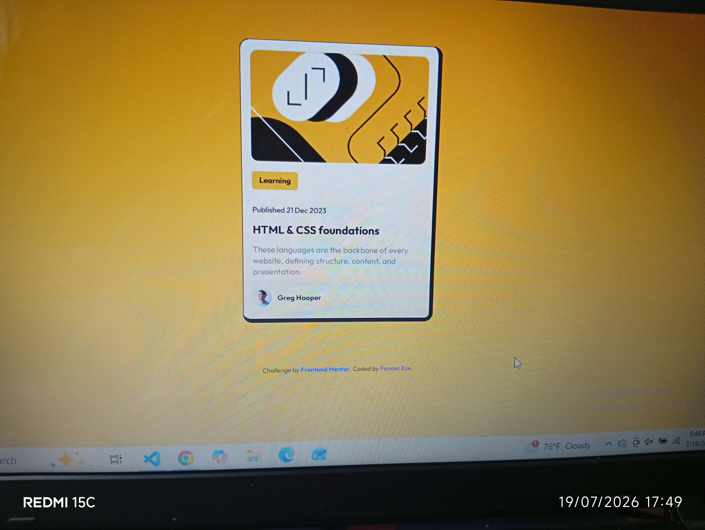

# Frontend Mentor - Blog Preview Card Solution

This is my solution to the **Blog Preview Card** challenge on Frontend Mentor. I built this project to practice semantic HTML, CSS styling, and creating a clean, responsive card layout.

## Overview

This project recreates the Blog Preview Card design provided by Frontend Mentor. The goal was to build a clean, responsive card using semantic HTML and CSS while matching the design as closely as possible.

### Screenshot

s
### Links

- Live Site URL: Coming soon
- Solution URL: Coming soon

## Built with

- Semantic HTML5
- CSS3
- Flexbox
- Responsive layout
- Google Fonts (Outfit)

## What I learned

While building this project, I improved my understanding of semantic HTML by using meaningful elements such as `main`, `h1`, and paragraphs. I also practiced using Flexbox to align the author section and learned how to create a clean, responsive layout that works well on different screen sizes.

## Continued development

I want to continue improving my CSS skills, especially Flexbox, CSS Grid, responsive design, and accessibility by building more Frontend Mentor projects.

## Author

- GitHub: https://github.com/Favour-debug-coder
- Frontend Mentor: https://www.frontendmentor.io/profile/Favour-debug-coder